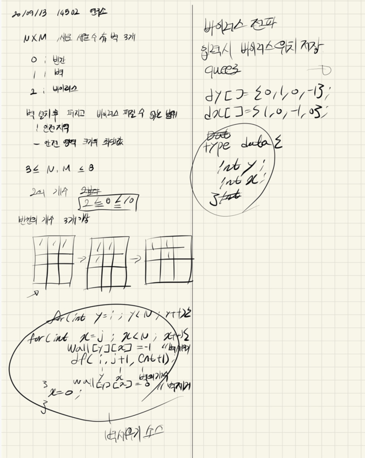

## 21.09.13_14502-연구소

## 소스코드

```c++
#include <stdio.h>
#include <iostream>
#include <vector>
#include <string.h>
#include <queue>
using namespace std;
#define NSIZE 8
#define MSIZE 8
int wall[NSIZE][MSIZE];//벽, 공백, 바이러스 저장되는 배열
int answer;//최대 결과갑 저장
int N, M;
struct Data {
	int y, x;
};
vector<Data>virus;
int dy[] = { 0,1,0,-1 };
int dx[] = { 1,0,-1,0 };
void init();
void dfs(int i, int j, int cnt);
bool safe(int y, int x);//범위 체크
//검증코드
void checkWall(int a[NSIZE][MSIZE]); //제대로 벽세워지는지
void checkVirus(vector<Data>v);//제대로 바이러스 뽑는지
int main(void) {
	int testCase = 1;
	for (int tc = 1; tc <= testCase; tc++) {
		init();
		dfs(0, 0, 0);//벽세우고 계산하기
		//printf("#%d %d\n", tc, answer);
		printf("%d\n", answer);
	}
	return 0;
}

void dfs(int i, int j, int cnt) {
	if (cnt == 3) {
		//checkWall(wall);
		//바이러스 검사후 안전영역 확인
		queue<Data>q;
		int visit[NSIZE][MSIZE] = { 0, };//방문체크
		for (int i = 0; i < virus.size(); i++) {
			q.push({ virus[i].y,virus[i].x });
			visit[virus[i].y][virus[i].x] = 1;
		}
		while (!q.empty()) {
			Data  c = q.front(); q.pop();
			for (int dir = 0; dir < 4; dir++) {
				Data n;
				n.y = c.y + dy[dir];
				n.x = c.x + dx[dir];
				if (safe(n.y, n.x) && wall[n.y][n.x] == 0 && visit[n.y][n.x] == 0) {
					visit[n.y][n.x] = 1;
					q.push(n);
				}
			}
		}
		int cnt = 0;
		for (int i = 0; i < N; i++) {
			for (int j = 0; j < M; j++) {
				if (wall[i][j] == 0 && visit[i][j] == 0) {
					cnt++;
				}
			}
		}
		answer = answer < cnt ? cnt : answer;
		return;
	}
	for (int y = i; y < N; y++) {
		for (int x = j; x < M; x++) {
			if (wall[y][x] == 0) {
				wall[y][x] = -1;
				dfs(y, x + 1, cnt + 1);
				wall[y][x] = 0;
			}
		}
		j = 0;
	}
}
void init() {
	answer = 0x80000000;
	N = M = 0;
	memset(wall, 0, sizeof(wall));
	scanf("%d %d", &N, &M);
	for (int i = 0; i < N; i++) {
		for (int j = 0; j < M; j++) {
			scanf("%d", &wall[i][j]);
			if (2 == wall[i][j]) {
				virus.push_back({ i, j });//바이러스 저장
			}
		}
	}
	//checkVirus(virus);
}

bool safe(int y, int x) {//범위 체크
	return 0 <= y && y < N && 0 <= x && x < M;
}

//검증코드
void checkVirus(vector<Data>v) {
	for (int i = 0; i < v.size(); i++) {
		printf("%d %d\n", v[i].y, v[i].x);
	}
}
void checkWall(int a[NSIZE][MSIZE]) {
	for (int i = 0; i < N; i++) {
		for (int j = 0; j < M; j++) {
			printf("%d ", a[i][j]);
		}
		printf("\n");
	}
	printf("\n");
}
```

## 설계



- 처음 벽을 어떻게 3개를 반복문을 써서 세우냐 인데
- 이거 원래 6중 포문으로 벽세워도 된다. 하지만 재귀를 이용하면 더 짧게 가능하다 이점 주의해서 외우자
- 그리고 원래 이거 바이러스 퍼지는거 큐로 해도되고 dfs로 해도되는데 bfs경우 느릴 수 있음 
- 두가지 방식으로 풀어봐야함

## 실수

- 딱히 오늘은 실수는 없었다. 단지 조금 느리다 싶은 느낌
- 은근 쉬운 문제인데 구현한 내용이 꽤 된다. 그렇기 때문에 구현력과 스피드 올려야할 듯 싶다.
- 그래야 성공한다. 아자아자

## 알고리즘사이트

[14502-연구소](https://www.acmicpc.net/problem/14502)

## 원본

