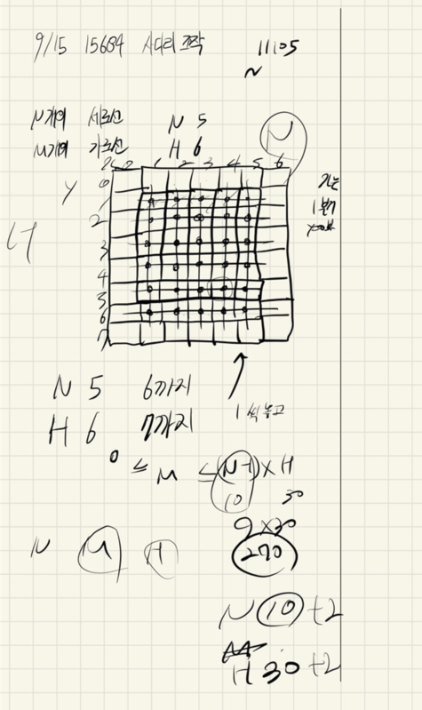

## 2021.09.15_15684-사다리조작

## 소스코드

```c++
#include<iostream>
#include<stdio.h>
#include<vector>
using namespace std;
#define NS 12
#define HS 32

int N, M, H;//세로, 가로선의 수 , 세로선마다 놓을 수 있는 가로선 수
int answer;//정답
int board[HS][NS];

void init();
void dfs(int y, int x, int cnt, int maxNum);

int main(void) {
	int testCase = 1;
	for (int tc = 1; tc <= testCase; tc++) {
		init();
		for (int i = 0; i <= 3; i++) {
			dfs(1, 1, 0, i);
			if (answer != -1)break;
		}
		printf("%d\n", answer);
	}
	return 0;
}
void init() {
	N = M = H = 0;
	answer = -1;
	scanf("%d %d %d", &N, &M, &H);
	for (int m = 0; m < M; m++) {
		int y, x;
		scanf("%d %d", &y, &x);
		board[y][x] = 1;
	}
}
void dfs(int y, int x, int cnt, int maxNum) {
	if (answer != -1)return;
	if (cnt == maxNum) {
		int cnt = 0;
		for (int num = 1; num <= N; num++) {
			int i = 0;
			int j = num;
			while (1) {
				if (board[i][j] == 1) j++;
				else if (board[i][j - 1] == 1)j--;
				i++;
				if (i == H + 1)break;
			}
			if (j != num)return;
			if (j == num)cnt++;
		}
		if (cnt == N) answer = maxNum;

		return;
	}
	for (int i = y; i <= H; i++) {
		for (int j = x; j <= N; j++) {
			if (0 == board[i][j] && 0 == board[i][j - 1] && 0 == board[i][j + 1]) {
				board[i][j] = 1;
				dfs(i, j + 1, cnt + 1, maxNum);
				board[i][j] = 0;
			}
		}
		x = 1;
	}
}
```

## 설계



## 실수

- 실수한것은 딱하나? 사다리 타고 내려갔는데 자기 번호 아닐때 그 숫자를 리턴안해준거
- 그것때문에 시간초과가 생김
- 이 부분은 실전에서 이렇게 된다면 진짜 맨탈이 깨질 수 있으니 조심

## 문제링크

[15684-사다리조작](https://www.acmicpc.net/problem/15684)

## 원본

