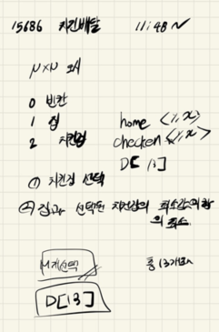

## 2021.09.16_15686-치킨배달

## 소스코드

```c++
#include<stdio.h>
#include<vector>
#include<string.h>
#include<algorithm>
using namespace std;
#define NS 51
struct Data {
	int y, x;
};

vector<Data>chicken;
vector<Data>home;

int N, M;//배열 가로세로크기, 뽑아야할 치킨집
int answer;
int board[NS][NS];//입력 배열
int D[15];//치킨 선택

void init();//초기화
void chickenChoose();//치킨선택
void dfs(int idx, int cnt);
int main(void) {
	int testCase = 1;
	for (int tc = 1; tc<=testCase; tc++) {
		init();
		chickenChoose();
		printf("%d\n", answer);
	}
}
void init() {
	N = M = 0;
	answer = 0x7fffffff;
	memset(board, 0, sizeof(board));
	home.clear(); chicken.clear();
	scanf("%d %d", &N, &M);
	for (int i = 0; i < N; i++) {
		for (int j = 0; j < N; j++) {
			scanf("%d", &board[i][j]);
			if (1 == board[i][j]) {//집 저장
				home.push_back({ i,j });
			}
			else if (2 == board[i][j]) {//치킨 저장
				chicken.push_back({ i,j });
			}
		}
	}
}
void chickenChoose() {
	dfs(0, 0);
}
void dfs(int idx, int cnt) {
	if (idx > chicken.size())return;
	if (cnt==M) {
		int sum = 0;
		for (int i = 0; i < home.size(); i++) {
			int homeMin = 0x7fffffff;
			for (int j = 0; j < chicken.size(); j++) {
				if (D[j] == 1) {
					int absNum = abs(home[i].y - chicken[j].y) + abs(home[i].x - chicken[j].x);
					homeMin = homeMin > absNum ? absNum : homeMin;
				}
			}
			sum += homeMin;
		}
		answer = answer > sum ? sum : answer;
		return;
	}
	D[idx] = 1;
	dfs(idx + 1, cnt + 1);
	D[idx] = 0;
	dfs(idx + 1, cnt);
}
```

## 설계



## 실수

- 이런 분류는 눈 감고도 해야하지 않을까 한다. 다시 복습하는 차원이기도 하기때문에 절대 실수는 없다.

## 문제링크

[15686-치킨배달](https://www.acmicpc.net/problem/15686)

## 원본

