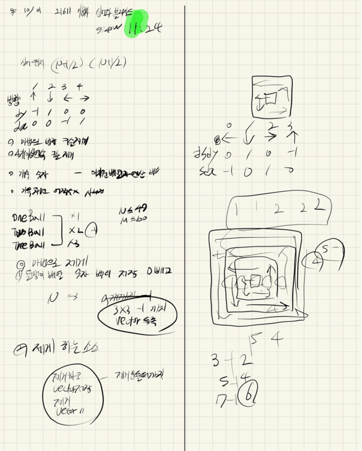

## 2021.10.01_21611-마법사상어와블리자드

## 소스코드

```c++
#include<stdio.h>
#include<iostream>
#include<string.h>
#include<vector>
using namespace std;
#define SIZE 50
#define ONE 1
#define TWO 2
#define THREE 3
int N,M;
int board[SIZE][SIZE];//배열저장
vector<int>balls;
vector<int>makeBalls;
int dy[] = {0,-1,1,0,0 };
int dx[] = {0, 0,0,-1,1 };
int sdy[] = { 0,1,0,-1 };
int sdx[] = { -1,0,1,0 };
int oneBall, twoBall, threeBall;
void init();//초기화 및 배열 입력
void magic();//마법 시전
void fire();//불 마법
void saveBall();//공 모으기
void removeBall();//공 제거

int main(void) {
	int testCase = 1;
	for (int tc = 1; tc <= testCase; tc++) {
		init();
		magic();
		int answer = (1 * oneBall) + (2 * twoBall) + (3 * threeBall);
		printf("%d\n", answer);
	}
	return 0;
}
void init() {
	N = M = 0;
	memset(board, 0, sizeof(board));
	balls.clear();
	scanf("%d %d", &N, &M);
	for (int i = 1; i <= N; i++) {
		for (int j = 1; j <= N; j++) {
			scanf("%d", &board[i][j]);
		}
	}
}
void saveBall() {
	balls.clear();
	int y, x;
	y = x = (N + 1) / 2;
	int count = 2;
	int number = 1;
	int dir = 0;
	int checkBoard[SIZE][SIZE] = { 0, };
	while (1) {

		if (number == N - 1)count = 3;

		if (y == 1 && x == 1)break;
		for (int c = 0; c < count; c++) {
			for (int n = 0; n < number; n++) {
				int ny = y + sdy[dir];
				int nx = x + sdx[dir];
				//checkBoard[ny][nx] = number;
				if(board[ny][nx]!=0) balls.push_back(board[ny][nx]);
				board[ny][nx] = 0;
				y = ny; x = nx;
			}
			dir = (dir + 1) % 4;
		}

		number++;

	}
}
void fire() {
	int y, x;
	y = x = (N + 1) / 2;

		int dir, cnt;
		scanf("%d %d", &dir, &cnt);
		for (int c = 0; c < cnt; c++) {
			int ny = y + dy[dir];
			int nx = x + dx[dir];
			//if (board[ny][nx] == ONE)oneBall++;
			//else if (board[ny][nx] == TWO)twoBall++;
			//else if (board[ny][nx] == THREE)threeBall++;
			board[ny][nx] = 0;
			y = ny; x = nx;
		}
}
void removeBall() {
	
	while (1) {
		int flag = 0;
		for (int i = 0; i < balls.size() - 1; i++) {
			if (balls.size() == 0)break;
			for (int j = i + 1; j < balls.size(); j++) {
				if (balls[i] != balls[j])break;
				int cnt = 1;
				if (balls.size() == 0)break;
				while (balls[i] == balls[j]) {
					cnt++;
					j++;
					if (j == balls.size())break;
				}
				if (cnt >= 4) {
					flag = 1;
					if (balls[i] == ONE)oneBall += cnt;
					else if (balls[i] == TWO)twoBall += cnt;
					else if (balls[i] == THREE)threeBall += cnt;
					balls.erase(balls.begin() + i, balls.begin() + j);
					i--;
					break;
				}
				else break;
			}
		}
		if (flag == 0)break;
	}
}
void makeBall() {
	makeBalls.clear();
	for (int i = 0; i < balls.size() - 1; i++) {
		if (balls.size() == 0)break;
		for (int j = i + 1; j < balls.size(); j++) {
			int cnt = 1;
			if (balls.size() == 0)break;
			while (balls[i] == balls[j]) {
				cnt++;
				j++;
				if (j == balls.size())break;
			}
			makeBalls.push_back(cnt);
			makeBalls.push_back(balls[i]);
			i = j;
			i--;
			if (i + 1 == balls.size()-1) {
				makeBalls.push_back(1);
				makeBalls.push_back(balls[i+1]);
			}
			break;
		}
	}

}
void sortBall() {
	int idx = 0;
	int y, x;
	y = x = (N + 1) / 2;
	int count = 2;
	int number = 1;
	int dir = 0;
	int checkBoard[SIZE][SIZE] = { 0, };
	while (1) {

		if (number == N - 1)count = 3;

		if (y == 1 && x == 1)break;
		for (int c = 0; c < count; c++) {
			for (int n = 0; n < number; n++) {
				int ny = y + sdy[dir];
				int nx = x + sdx[dir];
				if (makeBalls.size() != 0) {
					board[ny][nx] = makeBalls.front();
					makeBalls.erase(makeBalls.begin());
				}
				y = ny; x = nx;
			}
			dir = (dir + 1) % 4;
		}

		number++;

	}
}
void magic() {
	for (int m = 0; m < M; m++) {

		fire();
		saveBall();
		removeBall();
		makeBall();
		sortBall();
	}
}
```

## 설계



## 실수

- 여러개 제거 할때 마지막에 한개의 수인 경우 (현재 알고리즘 소스에서)
  - 이경우 잘 걸러줘야함 그래서 마지막에 1개가 남았으면 그 경우는 한번더 추가를 해야함 
- 좀더 잘해야하는것은 연속되는수를 더 효율적으로 빠르게 제거하는소스 구현하기 

## 문제링크

[21611-마법사상어와블리자드](https://www.acmicpc.net/problem/21611)

## 원본

