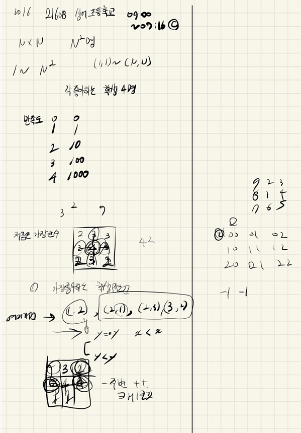

## 2021.10.06_21608-상어초등학교

## 소스코드

```c++
#include<stdio.h>
#include<iostream>
#include<algorithm>
#include<string.h>
#include<vector>
#include<queue>
using namespace std;
#define SIZE 401
struct Data {
	int y, x;
};
int sumNum[] = { 0,1,10,100,1000 };
int dy[] = { 0,1,0,-1 };
int dx[] = { 1,0,-1,0 };
int N;
int answer;
int board[SIZE][SIZE];
int people[SIZE][5];
int people1[SIZE][5];

void init();//초기화및 초기입력
bool safeZone(int y, int x);// 범위 체크
void seat();//자리 선정
void empty(int one, int two, int three, int four);// 공백확인
void empty2();
bool cmp(Data a, Data b);
void solve();//결과값

vector<Data>a;
struct DataInfo {
	int y, x, zeroCnt = 0, likeCnt = 0;
	bool operator <(const DataInfo&i)const {
		if (likeCnt == i.likeCnt) {
			if (zeroCnt == i.zeroCnt) {
				if (y == i.y)return x > i.x;//작은것
				else return y > i.y;
			}
			else return zeroCnt < i.zeroCnt;//많은거
		}
		else return likeCnt < i.likeCnt;//많은거
	}
};//우선순위 큐 이므로
int main(void) {
	int testCase = 1;
	for (int tc = 1; tc <= testCase; tc++) {
		init();
		seat();
		solve();
		printf("%d\n", answer);
	}
	return 0;
}
void solve() {

	int c[SIZE][SIZE] = { 0, };
	for (int i = 1; i <= N; i++) {
		for (int j = 1; j <= N; j++) {
			for (int k = 1; k <= 4; k++) {
				for (int dir = 0; dir < 4; dir++) {
					Data n;
					n.y = i + dy[dir];
					n.x = j + dx[dir];
					if (safeZone(n.y, n.x) && (people1[board[i][j]][k] == board[n.y][n.x])) {
						c[i][j]++;
					}
				}//dir
			}//k
			answer+= sumNum[c[i][j]];
		}//j
	}//i
}
void init() {
	N = 0;
	memset(board, 0, sizeof(board));
	scanf("%d", &N);
	for (int i = 1; i <= N*N; i++) {
		int num, one, two, three, four;
		scanf("%d %d %d %d %d", &num, &one, &two, &three, &four);
		people[i][0]=num,people[i][1] = one, people[i][2] = two, people[i][3] = three, people[i][4] = four;
	 people1[num][1] = one, people1[num][2] = two, people1[num][3] = three, people1[num][4] = four;
	}
}

bool safeZone(int y, int x) {
	return 1 <= y && y <= N && 1 <= x && x <= N;
}

bool cmp(Data a, Data b) {
	if (a.y == b.y)return a.x < b.x;
	return a.y < b.y;
}
void empty(int one, int two, int three, int four) {
	//like
	int c[SIZE][SIZE] = { 0, };
	for (int i = 1; i <= N; i++) {
		for (int j = 1; j <= N; j++) {
			if (board[i][j] == one || board[i][j] == two || board[i][j] == three || board[i][j] == four) {
				for (int dir = 0; dir < 4; dir++) {
					Data n;
					n.y = i + dy[dir];
					n.x = j + dx[dir];
					if (safeZone(n.y, n.x) && board[n.y][n.x] == 0) {
						c[n.y][n.x]++;
					}
				}
			}
		}
	}
	int maxnum = 0x80000000;
	for (int i = 1; i <= N; i++) {//큰 수
		for (int j = 1; j <= N; j++) {
			maxnum = max(maxnum, c[i][j]);
		}
	}
	if (maxnum != 0) {
		for (int i = 1; i <= N; i++) {//큰 수
			for (int j = 1; j <= N; j++) {
				if (c[i][j] == maxnum) {
					a.push_back({ i,j });
				}
			}
		}
	}//if
	else {// 그냥 아무것도 없는 경우
		for (int i = 1; i <= N; i++) {
			for (int j = 1; j <= N; j++) {
				for (int dir = 0; dir < 4; dir++) {
					Data n;
					n.y = i + dy[dir];
					n.x = j + dx[dir];
					if (board[i][j]==0&&safeZone(n.y, n.x) && board[n.y][n.x] == 0) {
						c[i][j]++;
					}
				}
			}
		}
		int maxnum = 0x80000000;
		for (int i = 1; i <= N; i++) {//큰 수
			for (int j = 1; j <= N; j++) {
				maxnum = max(maxnum, c[i][j]);
			}
		}
		if (maxnum != 0) {
			for (int i = 1; i <= N; i++) {//큰 수
				for (int j = 1; j <= N; j++) {
					if (c[i][j] == maxnum) {
						a.push_back({ i,j });
					}
				}
			}
		}
		else {
			for (int i = 1; i <= N; i++) {//큰 수
				for (int j = 1; j <= N; j++) {
					if (board[i][j] == 0) {
						a.push_back({ i,j });

					}
				}
			}
		}
	}

}
void empty2() {
	int c[SIZE][SIZE] = { 0, };
	for (int i = 0; i < a.size(); i++) {
		for (int dir = 0; dir < 4; dir++) {
			Data n;
			n.y = a[i].y + dy[dir]; n.x = a[i].x + dx[dir];
			if (safeZone(n.y, n.x) && board[n.y][n.x] == 0) {
				c[a[i].y][a[i].x]++;
			}
		}
	}
	a.clear();
	int maxnum = 0x80000000;
	for (int i = 1; i <= N; i++) {//큰 수
		for (int j = 1; j <= N; j++) {
			maxnum = max(maxnum, c[i][j]);
		}
	}
	if (maxnum != 0) {
		for (int i = 1; i <= N; i++) {//큰 수 저장
			for (int j = 1; j <= N; j++) {
				if (c[i][j] == maxnum) {
					a.push_back({ i,j });
				}
			}
		}
	}
	else {
		for (int i = 1; i <= N; i++) {//큰 수 저장
			for (int j = 1; j <= N; j++) {
				if (board[i][j] == 0) {
					a.push_back({ i,j });
				}
			}
		}
	}
}
void seat() {
	//for (int i = 1; i <= N * N; i++) {
	//	int num, one, two, three, four;
	//	scanf("%d %d %d %d %d", &num, &one, &two, &three, &four);
	//	people[num][1] = one, people[num][2] = two, people[num][3] = three, people[num][4] = four;
	//	a.clear();
	//	//1 비어있는 칸 중에서 좋아하는 학생이 인접한 칸에 가장 많은 칸으로 자리를 정한다.
	//	empty(one, two, three, four);
	//	if (a.size() == 1) {
	//		board[a[0].y][a[0].x] = num;
	//		a.clear();
	//	}
	//	//	2 1을 만족하는 칸이 여러 개이면, 인접한 칸 중에서 비어있는 칸이 가장 많은 칸으로 자리를 정한다.
	//	if (a.size() != 0 && a.size() > 1) {//여러개인경우
	//		empty2();
	//	}
	//	if (a.size() == 1) {
	//		board[a[0].y][a[0].x] = num;
	//		a.clear();
	//	}
	//	//	3 2를 만족하는 칸도 여러 개인 경우에는 행의 번호가 가장 작은 칸으로, 그러한 칸도 여러 개이면 열의 번호가 가장 작은 칸으로 자리를 정한다.
	//	if (a.size() != 0 && a.size() > 1) {//여러개인경우
	//		sort(a.begin(), a.end(), cmp);
	//		board[a[0].y][a[0].x] = num;
	//	}
	//	if (a.size() == 1) {
	//		board[a[0].y][a[0].x] = num;
	//		a.clear();
	//	}
	//}
	for (int s = 1;  s<= N * N; s++) {

		priority_queue<DataInfo> pq;
		for (int i = 1; i <= N; i++) {
			for (int j = 1; j <= N; j++) {
				if (board[i][j] == 0) {
					int zeroCnt = 0, likCnt = 0;
					for (int dir = 0; dir < 4; dir++) {
						Data n; 
						n.y = i + dy[dir]; n.x = j + dx[dir];
						if (!safeZone(n.y, n.x))continue;
						if (board[n.y][n.x] == 0)zeroCnt++;
						else {
							for (int k = 1; k <= 4; k++) {
								if (board[n.y][n.x] == people[s][k]) {
									likCnt++;
									break;
								}
							}
						}
					}//dir
					pq.push({ i,j,zeroCnt,likCnt });
				}
			}
		}
		if (!pq.empty()) {
			DataInfo c = pq.top();
			board[c.y][c.x] = people[s][0];
		}
	}
	
}
```

## 설계



## 실수

- 이게 그냥 구현하면 빈 설계가 있는듯
- 그래서 그냥 큐를 이용해서 그 조건에 맞는것을 돌림
  - 큐는 우선 순위 큐 사용 우선순위 큐는 조건에 맞게 top에 원하는값이 존재
- 이문제도 다시 한번 풀어봐야함 , 단순 구현이 아니고 이런 자료구조를 활용해서 더 빠르게 풀기

## 문제 링크

[21608-상어초등학교](https://www.acmicpc.net/problem/21608)

## 원본

