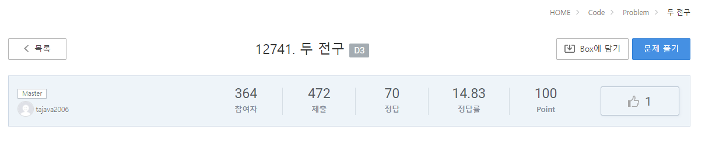
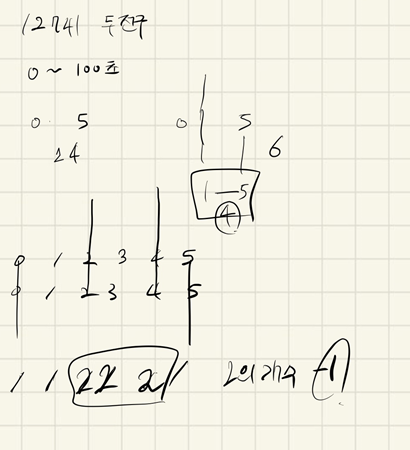

## 2021.10.18_12741-두전구



- 사실 이게 왜 14.83퍼센트인지 모르겠지만 무튼 아주 쉽게 풀 수 있음

## 소스코드

```c++
#include<iostream>
#include<stdio.h>
#include<string.h>
using namespace std;
int chk[101];
int A, B, C, D;
int answer;//결과값
void init();//초기화
void lightChk();//불켜기
int main(int argc, char** argv)
{
	int test_case;
	int T;
	cin >> T;

	for (test_case = 1; test_case <= T; ++test_case)
	{
		init();
		lightChk();
		printf("#%d %d\n", test_case, answer==0?0:answer-1);
	}
	return 0;//정상종료시 반드시 0을 리턴해야합니다.
}

void lightChk() {
	for (int i = A; i <= B; i++) {
		chk[i]++;
	}
	for (int i = C; i <= D; i++) {
		chk[i]++;
		if (chk[i] == 2)answer++;
	}
}
void init() {
	memset(chk, 0, sizeof(chk));
	A = B = C = D = answer=0;
	scanf("%d %d %d %d", &A, &B, &C, &D);
}
```

## 설계



- 흠 너무설계라고 하기에는 민망하지만
- 진짜 그냥 보자 마자 저렇게 했고 일단 두번 지나간것이라면 그건 두개의 전구가 켜지는것 이라고 생각
- 그리고 보면 2,3,4초 3초라고 생각하지만 정확히는 2초가 맞다 그래서 answer값도 -1해서 출력함
- 일단 정말 다시말하지만 정답률 이거는 90퍼는 되야한다고 생각하지만 다들 어렵게 생각했다고 생각함
- 아니면 정말 많이 안풀어서 정답률이 낮은지 의심스럽다.

## 실수

- 실수한 것은 없음 그냥 좀 변수명이  마음에 안들게 했던것 
- 하지만 너무 쉬운 문제에는 간단하게 푸는게 맞다고 생각한다.

## 문제 링크

[12741두 전구](https://swexpertacademy.com/main/code/problem/problemDetail.do?contestProbId=AXuUo_Tqs9kDFARa)

## 원본