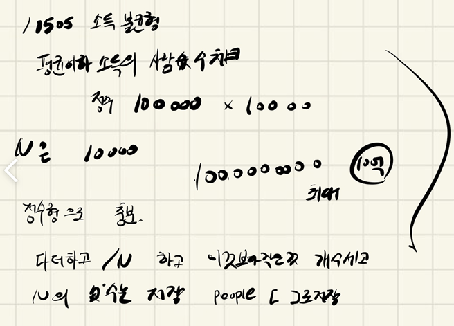

## 2021.10.21_10505-소득불균형

## 소스코드

```c++
#include<iostream>
#include<map>
#include<stdio.h>
#include<string.h>
using namespace std;
#define SIZE 100001
int answer;//결과값 저장
int people[SIZE];
int N;
map<int, int>peopleMap;
void init();//초기화 및 초기 입력
void money();//돈 계산
int main()
{
	int test_case;
	int T;

	scanf("%d", &T);
	for (test_case = 1; test_case <= T; ++test_case)
	{
		init();
		money();
		printf("#%d %d\n", test_case, answer);

	}
	return 0;//정상종료시 반드시 0을 리턴해야합니다.
}
void init() {
	N = answer = 0;
	peopleMap.clear();
	memset(people, 0, sizeof(people));
	scanf("%d", &N);

}
void money() {
	int sum = 0;
	for (int n = 0; n < N; n++) {
		int num;
		scanf("%d", &num);
		sum += num;
		peopleMap[num]++;
	}
	double sumResult = (double)(sum / N);
	for (auto iter: peopleMap) {
		if (iter.first <= sumResult) {
			answer += iter.second;
		}
	}
}
```

## 설계



- 우선 설계하기전에 정수형으로 충분히 받을 수 있는지 확인
- 그리고 나서 처음에는 배열에 전부 넣고 하려다가 map 즉 , 해시를 이용해서 몇개인지 판별해서 
- 그 해시에 저장된 데이터만 조건에 맞게 더하자 해서 map을 이용해서 데이터를 저장했고,
  - 평균을 구해서 평균보다 작은경우의 숫자를 저장해서 출력했음

## 실수

- 실수 없었음 
- 아직 이게 auto를 하고 하는게 익숙하지는 않는것 같다 익숙해졌으면 좋겠음

## 문제 링크

[10505-소득불균형](https://swexpertacademy.com/main/code/problem/problemDetail.do?problemLevel=3&contestProbId=AXNP4CvauaMDFAXS&categoryId=AXNP4CvauaMDFAXS&categoryType=CODE&problemTitle=&orderBy=FIRST_REG_DATETIME&selectCodeLang=ALL&select-1=3&pageSize=10&pageIndex=3)

## 원본

