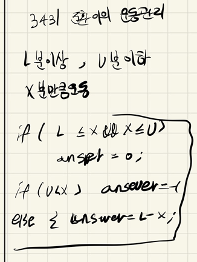

## 2021.10.22_3431-준환이의운동관리

## 소스코드

```c++
#include<iostream>
#include<stdio.h>
using namespace std;
int L, U, X;//운동 기록
int answer;
void init();//초기화 및 초기입력
void checkHealth();//운동 체크
int main(int argc, char** argv)
{
	int test_case;
	int T;
	scanf("%d", &T);

	for (test_case = 1; test_case <= T; ++test_case)
	{
		init();
		checkHealth();
		printf("#%d %d\n", test_case, answer);
	
	}
	return 0;//정상종료시 반드시 0을 리턴해야합니다.
}
void init() {
	L = U = X = 0;
	scanf("%d %d %d", &L, &U, &X);
}
void checkHealth() {
	if (L <= X && X <= U)answer = 0;
	else if (U < X)answer = -1;
	else answer = L - X;
}
```

## 설계



- 너무 단순하게 범위에 포함되면 0 출력 범위를 넘어서면 -1
- 범위를 넘지 못하면 최소의 값에 현재 운동량 뺀것 출력 하면됨

## 실수

- 쉬운 문제라 실수 없음

## 문제링크

[3431-준환이의 운동관리](https://swexpertacademy.com/main/code/problem/problemDetail.do?problemLevel=3&contestProbId=AWE_ZXcqAAMDFAV2&categoryId=AWE_ZXcqAAMDFAV2&categoryType=CODE&problemTitle=&orderBy=PASS_RATE&selectCodeLang=CCPP&select-1=3&pageSize=10&pageIndex=1)

## 원본

