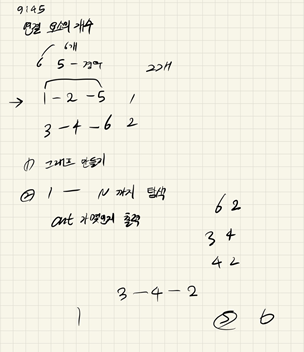

## 2021년08월04일_11724-연결요소의개수  

```c++
#include<stdio.h>
#include<vector>
#include<queue>
using namespace std;
#define NS 1001
int N, M;//정점의 개수, 간선의 개수 
int ret;//결과 값
vector<int>G[NS];
void init();
void search();
int main() {
	int testCase = 1;
	//scanf("%d", &testCase);
	for (int tc = 1; tc <= testCase; tc++) {
		init();
		search();
	//	printf("#%d %d\n", tc, ret);
		printf("%d\n", ret);
	}
	return 0;
}

void init() {
	N = M = ret = 0;
	scanf("%d %d", &N, &M);
	for (int n = 0; n < N; n++) {
		G[n].clear();
	}
	for (int m = 0; m < M; m++) {//그래프 생성
		int a, b;
		scanf("%d %d", &a, &b);
		G[a].push_back(b);
		G[b].push_back(a);

	}
}
void search() {
	queue<int>q;
	int visit[NS] = { 0, };// 방문 체크
	for (int i = 1; i <= N; i++) {
		if (visit[i] == 0) {
			ret++;
			visit[i] = 1;
			q.push(i);
			while (!q.empty()) {
				int d = q.front(); q.pop();
				
				for (int n = 0; n < G[d].size(); n++) {
					if (visit[G[d][n]] == 0) {
						visit[G[d][n]] = 1;
						q.push(G[d][n]);
					}
				}
			}
		}
	 }
}
```

- 처음 실수 한것은 양방향 그래프 인지를 고려하지 않아서 문제가 생김 
- 혹시나 구현을 제대로 한것 같은데 안된다 하고 하면 아래 경우를 해보자.

```c++
6 2
3 4
4 2
```

- 답은 4가 나와야한다. 

## 설계과정  



- 절대 이렇게 설계하면 안되지만 이런 쉬운문제라서 대략 두가지 틀만 잡았다.
- 첫 번째는 그래프 만들기 
- 두 번쨰는 그래프 탐색하면서 cnt  세는 것
- 사실 이문제는 단순한 그래프 탐색이었고, 가장 중요한것은 노드가 N 까지 존재한다는 사실과 양방향 으로 연결된 그래프를 구현해야한다는 점이다.

- 그래프를 푸는 방식 즉, 탐색하는 방식에는 dfs, bfs가 있다. 깊이 탐색과 너비 탐색이 있었는데 여기서 너비 탐색을 이용한 것은 1000개의 노드가 있어서 너무 깊어지면 느려질것 같아서 이런경우에 빠른 bfs 인 큐를 이용하여 탐색을 진행했다.
- 그래프 탐색이 말만 거창하지 단순 bfs와 다를 바 없으니 소스를 보고 한 번 구현해 보는것을 추천한다.
- 사실 그래프를 직접 구현하려면 어렵다 하지만 저렇게 백터를 이용하면 손쉽게 구할 수 있으니 알아놓자.