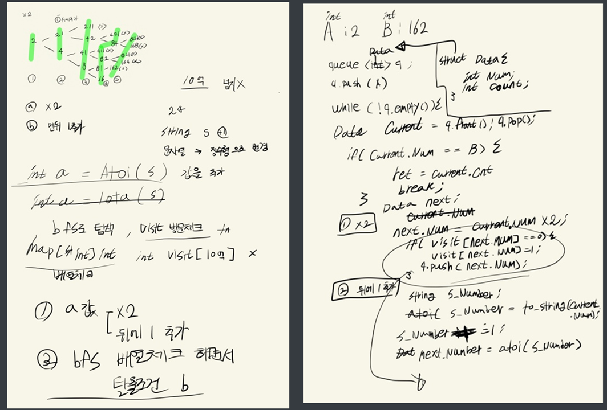

## 2021년08월04일_16953-A->B

```c++
#include<stdio.h>
#include<map>
#include<string>
#include<queue>
#include<iostream>
#include<algorithm>
using namespace std;
struct Data {
	long long int number;
	int cnt;
};
int A, B, ret;//A: 시작, B: 만들어야하는 숫자, ret: 결과값
void init() {
	A = B = 0; ret = 0x7fffffff;
	scanf("%d %d", &A, &B);
}
void AtoB() {
	map<long long int , int>visit;// 방문 체크 맵
	queue<Data>q;
	q.push({ A,1 });
	visit[A] = 1;
	while (!q.empty()) {
		Data current = q.front(); q.pop();
		if (current.number > B || current.number > 1000000000) continue;

		if (current.number == B) {
			ret = min(ret, current.cnt);
		}
		//*2
		Data next = current;
		next.number = current.number * 2;

		if (visit[next.number] == 0) {
			visit[next.number] = 1;
			q.push({ next.number,next.cnt + 1 });
		}
		//add 1
		next.number = (current.number * 10) + 1;
		if (visit[next.number] == 0) {
			visit[next.number] = 1;
			q.push({ next.number,next.cnt + 1 });
		}
	}
}
int main() {
	int testCase = 1;
	//scanf("%d", &testCase);
	for (int tc = 1; tc <= testCase; tc++) {
		init();
		AtoB();
		if (ret == 0x7fffffff) {
			ret = -1;
		}
		//printf("#%d %d\n", tc, ret);
		cout << ret << endl;
	}
}
```

- 설계 부터 오류가 생김
- 굳이 숫자 뒤에 1 붙이는 경우 문자열로 안해도 *10 +1 하면되는데 생각이 많아지면 산으로 가는듯
- 처음 설계를 그렇게 했지만 구현하다보니 굳이? 더 간단히 생각해서 후자의 방식을 사용
- 사실 이것도 복잡하게 구현함 더 쉽게 dfs를 사용해도 되고 거꾸로 생각해도된다. 그방식은 추후에 업데이트
- 설계는 글씨는 엉망이지만 아래와 같이 했고, bfs방식으로 진행 
- 배열 체크는 혹시나 10억이지만 최대 21억이 정수형 최대이지만 혹시나 해서 long long int로 맵 구성하고
- number도 long long int로 받음 

## 설계과정  

